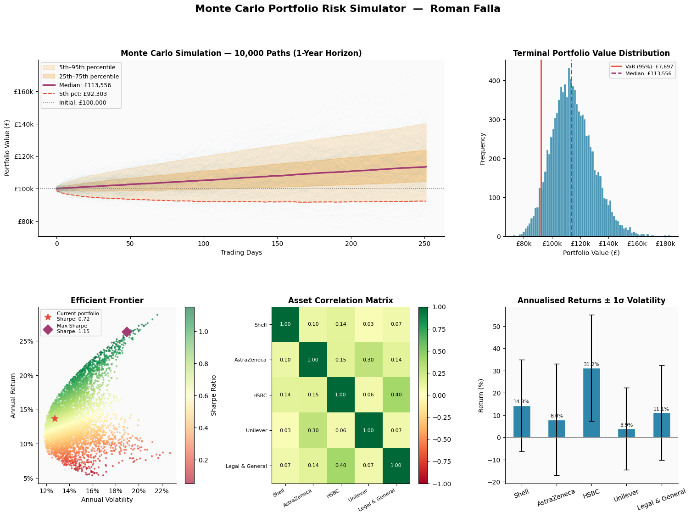

# Monte Carlo Portfolio Risk Simulator

Simulates portfolio return distributions using Monte Carlo methods on real FTSE 100 data.

## What it does

* Pulls 3 years of current historical price data via Yahoo Finance API
* Runs 10,000 correlated simulations using Cholesky decomposition to preserve asset correlations
* Computes Value at Risk (VaR), Conditional VaR (CVaR), and Sharpe Ratio
* Plots an approximate efficient frontier from 5,000 randomly weighted portfolios (no optimiser)
* Outputs a 5-chart dashboard saved as PNG

## Portfolio

The simulated portfolio contains five FTSE 100 stocks:

| Stock           | Weight |
| --------------- | -----: |
| Shell           |    25% |
| AstraZeneca     |    25% |
| HSBC            |    20% |
| Unilever        |    20% |
| Legal & General |    10% |

**Initial portfolio value: £100,000**

## Sample Output

Results from an 8 October 2026 run:

| Metric                |    Value |
| --------------------- | -------: |
| Annualised Return     |   13.69% |
| Annualised Volatility |   12.74% |
| Sharpe Ratio          |     0.72 |
| VaR (95%, 1yr)        |   £7,697 |
| CVaR (95%, 1yr)       |  £12,220 |
| Median Terminal Value | £113,556 |

## Methodology

Correlated daily asset returns are simulated as normal draws, with arithmetic returns compounded over a 252-trading-day horizon. The model does not use log-normal Geometric Brownian Motion (GBM).

The Cholesky decomposition of the historical correlation matrix is applied to standard normal random draws to preserve the observed relationships between assets.

VaR is calculated as the 5th percentile of the simulated terminal return distribution. CVaR is the average terminal return for simulations below the VaR threshold.

The efficient-frontier chart uses 5,000 randomly weighted portfolios to provide an approximate risk-return frontier. No optimisation algorithm is used.

## Usage

```bash
pip install yfinance pandas numpy matplotlib
python monte_carlo_portfolio_simulator.py
```

## Output



## Limitations

* Results depend on historical price data and assumptions used to calibrate the simulation.
* Yahoo Finance data may be delayed, incomplete or revised.
* Historical returns and correlations do not guarantee future performance.
* The efficient frontier is an approximation based on randomly generated portfolios rather than a mathematically optimised frontier.
* VaR and CVaR are model-based estimates and should not be interpreted as guarantees of future losses.
